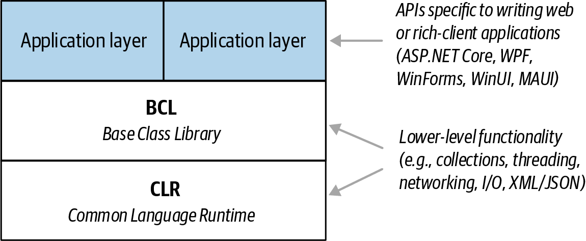

# Common Language Runtime (CLR)
- A Common Language Runtime (CLR) provides essential runtime services such as automatic memory management and exception handling.
- C# is called a managed language because it compiles source code into `managed code`, which is represented in `Intermediate Language (IL)`. The CLR converts the IL into the native code of the machine, such as X64 or X86, usually just prior to execution. This is referred to as `Just-in-Time (JIT)` compilation.
- `Ahead-of-time compilation` is also available to improve startup time with large assemblies or resource-constrained devices (and to satisfy iOS app store rules when developing mobile apps).
- The container for managed code is called an `assembly`. `An assembly contains not only IL but also type information (metadata). The presence of metadata allows assemblies to reference types in other assemblies without needing additional files.
- which is responsible for converting the `MSIL (Microsoft Intermediate Language) code` into `native code` and then execution through these steps:
```
Source code -> Language Compiler -> MSIL/IL/Managed Code -> CLR(JIT) -> Native code -> Execute
```
- In the .NET framework, the code is compiled `twice`.
  - In the `1st` compilation, the source code is compiled by the respective language compiler and generates the intermediate code which is known as `MSIL` (Microsoft Intermediate Language) or `IL` (Intermediate language code) Or `Managed Code`.
  - In the `2nd` compilation, `MSIL` is converted into `Native code` (native code means code specific to the Operating system so that the code is executed by the Operating System ) using CLR.
  - Always `1st` compilation is `slow` and `2nd` compilation is `fast`.

# Base Class Library (BCL)
- A CLR always ships with a set of assemblies called a `Base Class Library (BCL)`. A BCL provides core functionality to programmers, such as `collections, input/output, text processing, XML/JSON handling, networking, encryption, interop, concurrency, and parallel programming.`

- A BCL also implements types that the C# language itself requires (for features such as enumeration, querying, and asynchrony) and lets you explicitly access features of the CLR, such as reflection and memory management.


# Runtimes
- A `runtime (also called a framework)` is a deployable unit that you download and install. A runtime consists of a CLR (with its BCL), plus an optional application layer specific to the kind of application that you’re writing—web, mobile, rich client, etc. (If you’re writing a command-line console application or a non-UI library, you don’t need an application layer.)

- When writing an application, you target a particular runtime, which means that your application uses and depends on the functionality that the runtime provides. Your choice of runtime also determines which platforms your application will support.

# CLRs, BCLs, and Runtimes
- Runtime support for C# programs consists of a Common Language Runtime and a Base Class Library. A runtime can also include a higher-level application layer that contains libraries for developing rich-client, mobile, or web applications 


Figure 1.1 Runtime architecture

# JIT
- JIT stands for the `Just-in-Time` compiler. It is the component of CLR which is responsible for converting `MSIL` code into `Native` Code. This Native code is directly understandable by the operating system.
  Different types of DOTNET Framework.
  The .net framework is available in three different flavors

- `DOTNET Framework`: This is the general version required to run .NET applications on Windows OS only.
- .NET mono Framework: This is required if we want to run DOT NET applications on other OS like Unix, Linux, MAC OS, etc.
- DOT NET Compact Framework: This is required to run .NET applications on other devices like mobile phones and smartphones.
- NOTE: MSIL is only CPU dependent and will run only on Windows OS only using .NET Framework because .NET Framework is designed for Windows OS only.

- There is another company known as “NOVEL” designed separate framework known as “MONO Framework”. Using this framework we can run MSIL on different OS Like Linux, UNIX, Mac, BSD, OSX, etc.

- .NET is platform-dependent using the .NET framework but independent using the MONO framework.

# How a .NET application compiled and run?


- First, the developer has to write the code using any dot net supported programming languages such as C#, VB, J#, etc.
- Then the respective language compiler will compile the program into something called `Intermediate language (IL)` code. For example, if the programming language is C#, then the compiler is CSC and if the programming language is VB, then the compiler will be VBC. This Intermediate Language (IL) code is half compiled code i.e. partially compiled code and cannot be executed directly by the operating system.
- So, when you want to execute this IL code on your machine, the dot net framework provides something called CLR or Common Language Runtime which takes the responsibility to execute your IL Code.

- The CLR takes the IL (Intermediate Language) code and gives it to something called JIT (Just-in-Time) Compiler. The JIT compiler takes the IL code and reads each and every line of the IL code and converts it to machine-specific instructions (i.e. into binary format) which can be executed by the underlying operating system.

# Intermediate Language (IL) Code:

- IL code is a half compiled or partially compiled or CPU independent partially compiled code.

# Why Partial Compiled Code or why not fully compiled Code?

- As a developer, you may be thinking about why partially compiled code or why not fully compiled code. The reason is very simple. We don’t know in what kind of environment .NET Code will run (for example, Windows XP, Windows 7, Windows 10, Windows Server, etc.).
- In other words, we don’t know what operating system is going to run our application; we also don’t know the CPU configuration, machine configuration, security configuration, etc.
- So, the IL code is partially compiled and at runtime, this IL code is compiled to machine-specific instructions using environmental properties such as OS, CPU, Machine Configuration, etc.

# Complier vs Intepreter

- A `compiler` is a program that transforms source code written in one programming language into another programming language. "Why would I need this?" you ask, "I thought we were writing in C#?"
- The answer goes back to our earlier discussion about `machine codes` - the C# code that you write must be converted into something that your computer's processor can understand. The processor is, of course, the brain of the computer - the part that performs all its calculations. `The processor doesn't know C#; it only understands machine codes`.
- Let's zoom back out to the high level, where you just finished writing your C# code. When you run the C# compiler, it takes your code as an input, does some processing, and then outputs your program in `intermediate language (IL)` code which is saved in `*.exe or *.dll` files.


- This is not the end of the code permutations that take place under the hood. After the IL code is generated, we still don't have anything for our processor to read (remember, the processor can only understand machine codes). Someone or something therefore needs to convert the IL code to machine codes. The name for that something is the `Common Language Runtime`, or CLR.

- CLR is a program running on your computer that manages the execution of IL code. In simple terms, it knows how to deal with IL and how to execute programs that are written in IL code. It uses a `just-in-time`, or JIT, `compiler` to translate the IL code into `machine code` (sometimes called "native" code). `The JIT compiler is named as such because it compiles IL code at the moment that the user tries to use it; for example, when you double-click the .exe file`.


- Fortunately for us, both the CLR and JIT compiler know what hardware the computer consists of and compiles IL into a native code that the computer is comfortable with. This also provides some amount of future-proofing: if you write a program and compile it with the C# compiler today, and then forget about it for... say... 10 years, that same .exe file will most likely still run (and probably even faster than it would have today)! The JIT compiler would still look at the hardware of the (future) computer, determine what that computer could understand, and translate the IL code (in your 10-year-old .exe file) into that language and run the program.


# CLR Components

- CLR is the heart of the .NET Framework and it contains the following components.

## Security Manager

- There are basically two components to manage security. They are as follows:
  - CAS (Code Access Security)
  - CV (Code Verification)
- These two components are basically used to check the privileges of the current user that the user is allowed to access the assembly or not.
- The CLR also sees what kind of rights or what kind of authorities this code has and whether it is safe to be executed by the operating system. So, basically, these types of checks are maintained by the Security Manager.

## JIT Compiler

- The JIT Compiler is responsible for Converting the MSIL code into native code that is executed by the machine.
- The native code is directly understandable by the system hardware. JIT compiles the code just before the execution and then saves this translation in memory.

## Memory Manager

- The memory manager component allocates the necessary memory for the variables and objects that are to be used by the application.

## Exception Manager

- The Exception Manager component of CLR redirects the processor to execute catch or finally blocks whenever an exception has occurred at runtime.

## Common Type System (CTS)

- The .NET Framework supports many programming languages such as C#, VB.NET, J#, etc. Every programming language has its own data types. One programming language cannot understand other programming language data types. But, there can be situations when you want to code in one language to be called in other languages.

- In order to ensure smooth communication between these languages, the most important thing is that they should have a common type system (CTS) which ensures that `type defined in two different languages gets compiled to a common data type`.The .NET Framework supports many programming languages such as C#, VB.NET, J#, etc. Every programming language has its own data types. One programming language cannot understand other programming language data types. But, there can be situations when you want to code in one language to be called in other languages. In order to ensure smooth communication between these languages, the most important thing is that they should have a common type system (CTS) which ensures that type defined in two different languages gets compiled to a common data type.
- Examples in IL Code:

```
int32
int64
double
...
```

## Common Language Specification (CLS)

- CLS is a part of CLR. .NET supports many programming languages and every programming language has its own `syntactical rules` for writing the code which is known as language specification i.e. every programming language has its own language specification.

- One programming language cannot understand other programming language syntactical rules (language specification). But CLR will execute all programming languages code. This is possible because CLR cannot understand any programming language specification rather CLR has its own language specification (syntactical rules) for its MSIL.

- Every language compiler should follow this `language specification of CLR at the time of compilation` and should generate MSIL; CLR’s JIT compiler will generate native code from MSIL. This language specification of CLR is common for all programming languages code execution of .NET and is known as CLS.
- Examples:

```csharp
namespace CsharpClassLibrary
{
    public class Calculator
    {
        public int Calculate()
        {
            int a = 10, b = 20;
            int c = a + b;
            return c;
        }
        public int calculate()
        {
            int a = 10, b = 20;
            int c = a + b;
            return c;
        }
    }
}
```

```vb
Imports CsharpClassLibrary
Public Class TestClass
    Public Sub TestMethod()
        Dim obj As New Calculator()
        obj.Calculate()
    End Sub
End Class
```

- When you try to build the VB Class Library project, you will get the `below error`. This is because VB is not case sensitive and it found two methods with the same name. That means we are violating the Common Language Specifications in C# code.

`‘Calculate’ is ambiguous because multiple kinds of members with this name exist in class ‘Calculator’.`

## How to check the code is CLS Compliant or not?

- Once you open the AssemblyInfo.cs class file, then follow the below 2 steps.

- Step1: Import the System namespace
- Step2: Add the following CLSCompliant attribute at the bottom of this file and set its value to true

```csharp
using System;
[assembly: CLSCompliant(true)]
```

- when you build the C# Class Library Project you will get the following warning
  `warning CS3005: Identifer 'Calculator.calculate()' differing only in case is not CLS-compliant`

# .NET Program Execution Process

- The .NET application Source Code gets compiled into Microsoft Intermediate language `(MSIL)` which is also called Intermediate language `(IL)` or Common Intermediate language `(CIL`)`.

- Both .NET and Non DOTNET applications generate an assembly when we compile the application. Generally, the assemblies have an extension of. `DLL or .EXE` based on the type of application we compiled.

- For example, if we compile a window or Console application in .NET, we get an assembly of type.EXE whereas when we compile a web or Class Library Project in .NET, we get an assembly of type .DLL.

- The `difference between a .NET and NON-DOTNET assembly` is that DOT NET Assembly is an intermediate language format whereas NON .NET assembly is in native code format.

- NON .NET applications can run directly on top of the operating system as NON-DOTNET assembly contains the native code whereas .NET applications run on the top of a `virtual environment called Common Language Runtime (CLR)`. CLR contains a component called Just-In-Time Compiler (JIT) which will convert the Intermediate language into native code which can be understood by the underlying operating system.

## Execution steps:

- `Programming languages -> Language specific compiler -> IL or MSIL Code(.dll or .exe) -> CRL(JIT Compiler) -> Native machine code (underlying operating system)`

- .NET assemblies are `portable` to any platform as long as the target platform has the Common Language Runtime (CLR). The target platform’s CLR converts the Intermediate Language code into native code or machine code that the underlying operating system can understand.

- `Intermediate Language code` is also called as the `managed code`. This is because CLR manages the code that runs inside it. For example, in a VB6 program, the developer is responsible for de-allocating the memory consumed by an object. If a programmer forgets to de-allocate memory, then it may get out of memory exceptions. On the other hand, a .NET programmer needs not to worry about de-allocating the memory consumed by an object. `Automatic memory management is also known as garbage collection` is provided by CLR. Since CLR is managing and executing the Intermediate Language it (IL) is also called as the managed code.

- `.NET` supports different programming languages like `C#, VB, J#, and C++. C#, VB, and J# can only generate managed code (IL)` whereas C++ can generate both managed code (IL) and unmanaged code (Native code).

- The `native code is not stored permanently anywhere after we close the program the native code is thrown away`. When we execute the program again the native code gets generated again.

- The .NET program is similar to java program execution. `In Java, we have bytecodes and JVM (Java Virtual Machine) whereas in .NET we have Intermediate Language and CLR (Common Language Runtime)`.

# What happens when we compile a .NET Application?

- When we compile any .NET application it will generate an assembly with the extension either a `.DLL or an .EXE`. For example, if you compile windows or Console application, then you will get an .EXE, whereas if you compile a web or Class library project, then you will get a .DLL.
- Irrespective of whether it is a `.DLL or .EXE`, an assembly consists of two things `(Manifest and Intermediate language)`.

## Understanding Intermediate Language Code in C#:

```csharp
using System;
namespace ILDASMDemo
{
    class Program
    {
        static void Main(string[] args)
        {
            Console.WriteLine("Understanding ILDASM and ILASM");
            Console.Read();
        }
    }
}
```

- Now, build the application. Once you build the application, the above source code is compiled and intermediate language generated and packaged into an assembly. In order to see the assembly, just right-click on the Project and select Open Folder in File Explorer option and then go to the bin => Debug folder and you should see an assembly with .exe extension

```
ILDASMDemo.exe
ILDASMDemo.pdb
ILDASMDemo.vshost.exe.manifest
```


## What is Manifest?

- Manifest contains metadata about the assembly like the `name of the assembly, the version number of the assembly, culture, and strong name information and public key` as shown in the below image.

```
.assembly ILDASMDemo{
  .ver 1:0:0:0
}
```

## How to change Assembly info?

- Go to `AssemblyInfo.cs`

```csharp
[assembly: AssemmblyVersion('2.0.0.0')]
[assembly: AssemmblyVersion('1.0.0.0')]
```

# Managed and Unmanaged Code in .NET

- Whenever you create any exe (i.e. console application, windows application, class library project, etc.) or web application (i.e. ASP.NET MVC, Web API, ASP.NET, etc.) in dot net using visual studio and using any dot net supported programming language such as C#, VB, etc., then these applications are run completely under the control of CLR (Common Language Runtime).
- If your applications having unused objects, then CLR will clean those objects using Garbage Collector. If your application wants to communicate with other applications, then it will make sure that CTS (Common Type System) is available. CLR uses `CAS (Code Access Security)` if your application has the proper rights to execute. The CLR will load your application and unload your application, etc. So, for better understanding, please have a look at the following image.


- Now, let say, you have used other third-party exe in your dot net application like Skype, PowerPoint, Microsoft Excel, etc. These exe are not made in dot net, they are made using other programming languages such as C, C++.


- When you use this exe in your application, then these are not run by CLR. Even though you are running this exe in dot net applications, they are going to run under their own environment. For example, if one exe is developed using C or C++, then that exe will run under the C or C++ runtime environment. In the same line, if the exe is created using VB6, then it is going to run under the VB6 runtime environment.

## What exactly the managed and unmanaged code in .NET?

- The codes which run under the `complete control of CLR are called Managed Code` in .NET. These kinds of code (Managed code in C#) are run by dot net runtime environment. If the dot net framework is not installed or if dot net runtime is not available, then these kinds of codes are not going to be executed. CLR will provide all the facilities and features of .NET to the managed code execution like Language `Interoperability, Automatic memory management, Exception handling mechanism, code access security, etc`.

- On the other hand, `Skype, PowerPoint, Microsoft Excel does not require dot net runtime`, they run under their own environment. So, in short, the code (exe, web app) which not run under the control of CLR is called `unmanaged code` in .NET. CLR will not provide any facilities and features of .NET to the unmanaged code in C# execution like Language Interoperability, Automatic memory management, Exception handling mechanism, code access security, etc.

# High Frequency Heap


#  When does the common language runtime terminate?

The simple answer is: the CLR terminates when the host (process) terminates.

Also, there is a default AppDomain (that is not accessible). This AppDomain would continue to exist even if your AppDomain is unloaded. This is what I think Tigran was referring to as System.

# Ref
- https://dotnettutorials.net/lesson/intermediate-language
- https://learning.oreilly.com/library/view/c-10-in/9781098121945/ch01.html